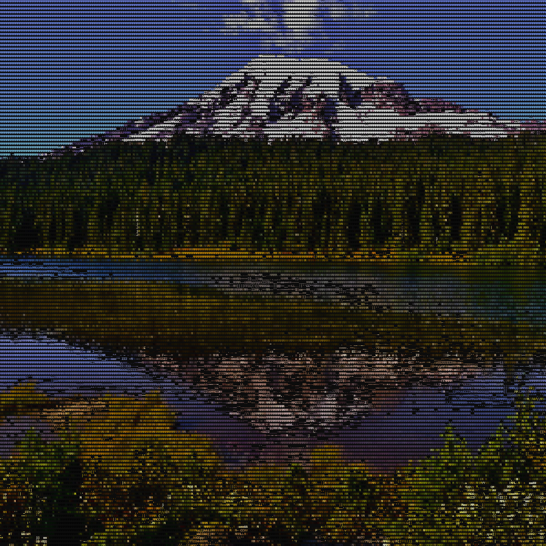
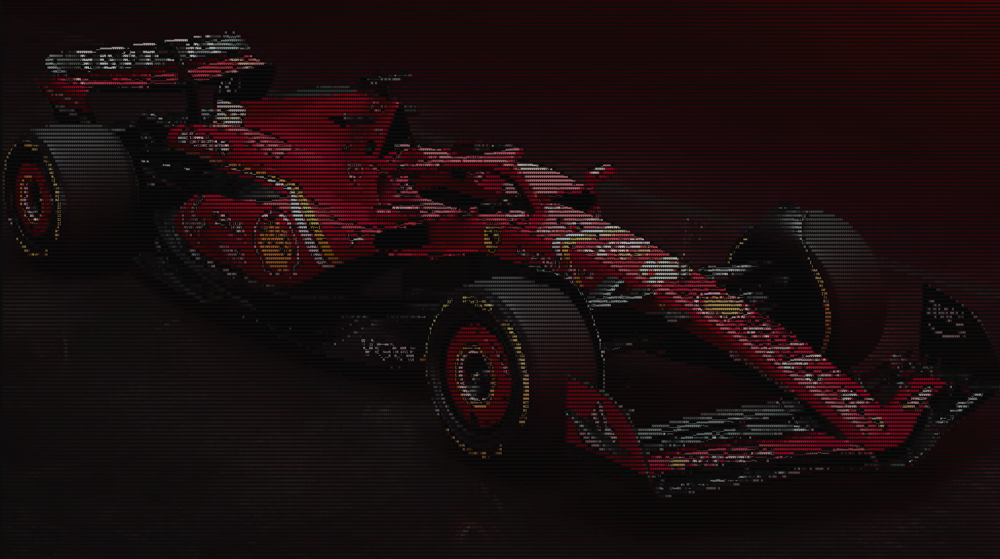

# ASCII Art Generator in C

This project is an ASCII art generator built in C. It converts BMP image files into ASCII art by mapping image features to printable ASCII characters. The output mimics the original image using ASCII characters and supports color rendering.

## How to Build and Run

### Build Instructions
1. Clone the repository:
   ```bash
   git clone https://github.com/rbaker1776/artscii.git
   ```
2. Compile the program:
   - Using `make` (`make` needs to be installed):
     ```bash
     make
     ```
   - Using `gcc` (`gcc` needs to be installed):
     ```bash
     gcc -std=c11 -g -Wall -Wshadow -Wvla -Werror -O3 src/artscii.c src/basic_vec.c src/main.c -o show
     ```
   - Using `clang` (`clang` needs to be installed):
     ```bash
     clang -std=c11 -g -Wall -Wshadow -Wvla -Werror -O3 src/artscii.c src/basic_vec.c src/main.c -o show
     ```

### Running the Program
1. To view a BMP image in ASCII art, use:
   ```bash
   ./show images/car.bmp
   ```
2. Explore other BMP images in the `images` directory, or convert your own images to BMP format and pass them to the program.  
   A BMP image converter is available here: [BMP Image Converter](https://cloudconvert.com/bmp-converter).

---

## Project Overview

### Files and Their Roles
- **`main.c`**:  
  Coordinates reading the image, processing it, and freeing memory.
  
- **`font8x8_basic.h`**:  
  Contains pixel brightness values for printable ASCII characters (sourced online).

- **`ascii.h`**:  
  Converts the arrays in `font8x8_basic.h` into C multidimensional arrays using `parse_chars.py`.

- **`artscii.h`**:  
  The main header file with struct definitions, macros, and function declarations.

- **`artscii.c`**:  
  Implements functions to read the image, process it with convolutions to identify features, and print characters in color.

- **`basic_vec.c`**:  
  Provides a barebones vector data structure to store image segment colors and determine the dominant color of each segment.

---

## Examples

Here are some example images and their ASCII representations:

- **Car**:  
    

- **Mountain**:  
    

- **Ferrari**:  
    

---

## Additional Resources
For a detailed explanation of the project, watch the YouTube video: [Build an ASCII Art Generator in 150 Lines](https://youtu.be/SSQ9Wnw4noA).